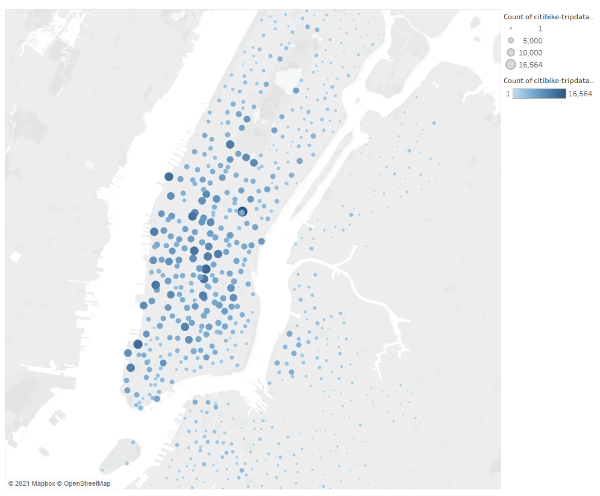
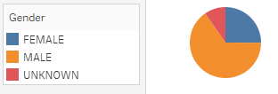
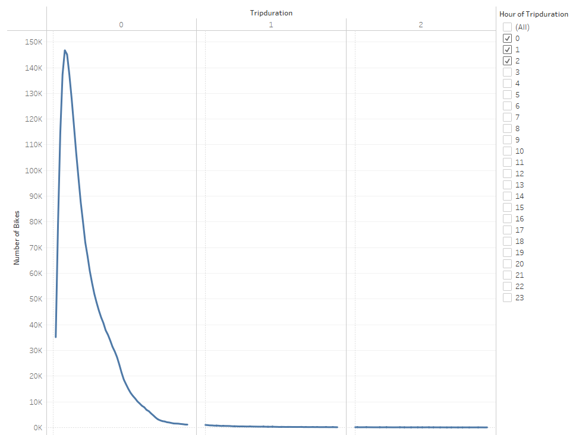
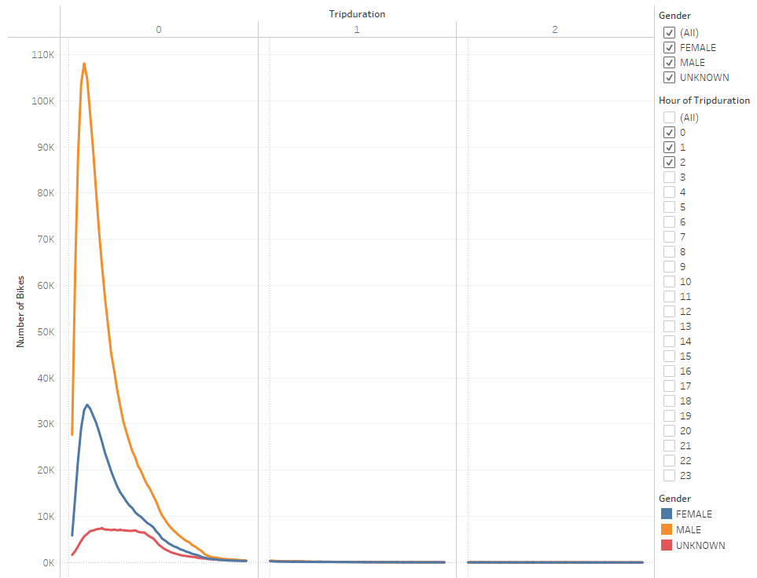
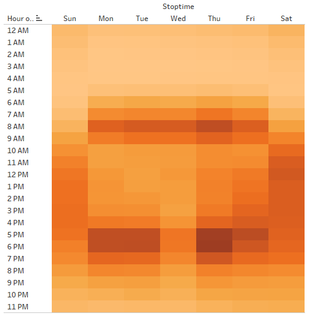
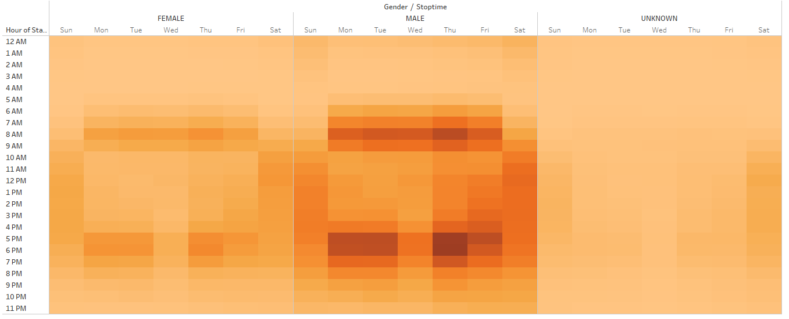
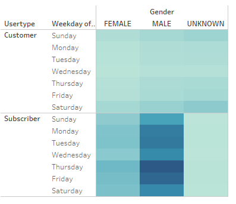

# Bikesharing

## Project Overview

This analysis was conducted to examine trip data from Citibike to determine if moving Citibike to Des Moines would be a logical business move. We examine the breakdown of bike ride users as well as summary statistics of various factors.

## Results

### Top Starting Locations

This is a map of where bike rides are most often started in NYC. The bigger and darker bubbles indicate a higher number of rides started.

### Gender Breakdown

## Summary

